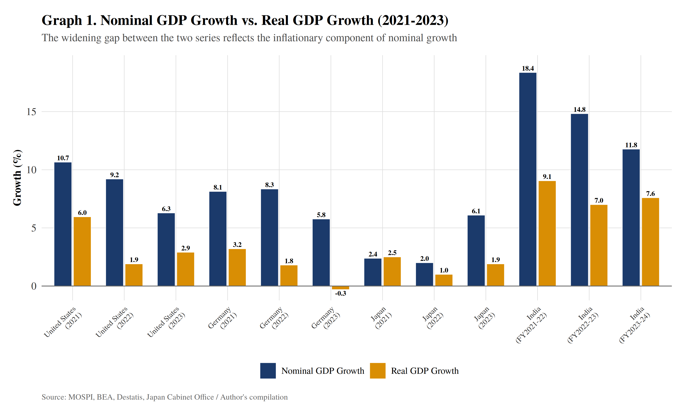
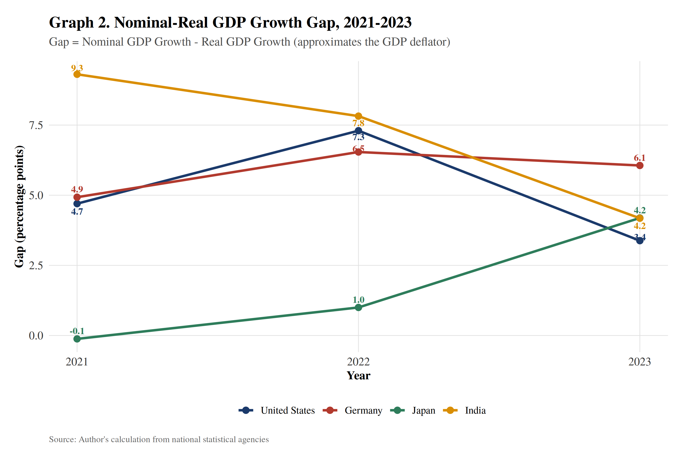
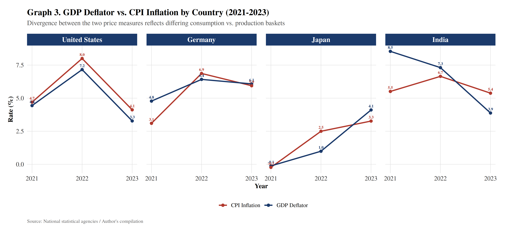
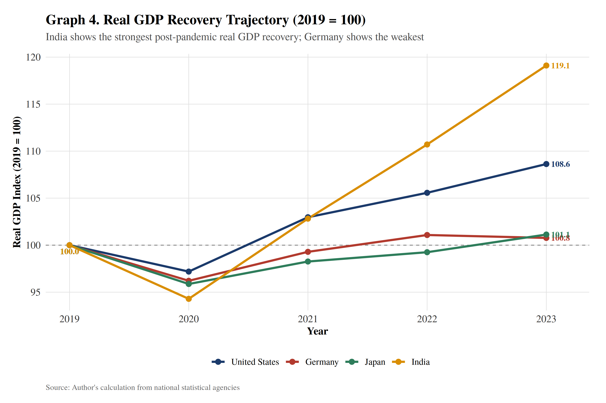
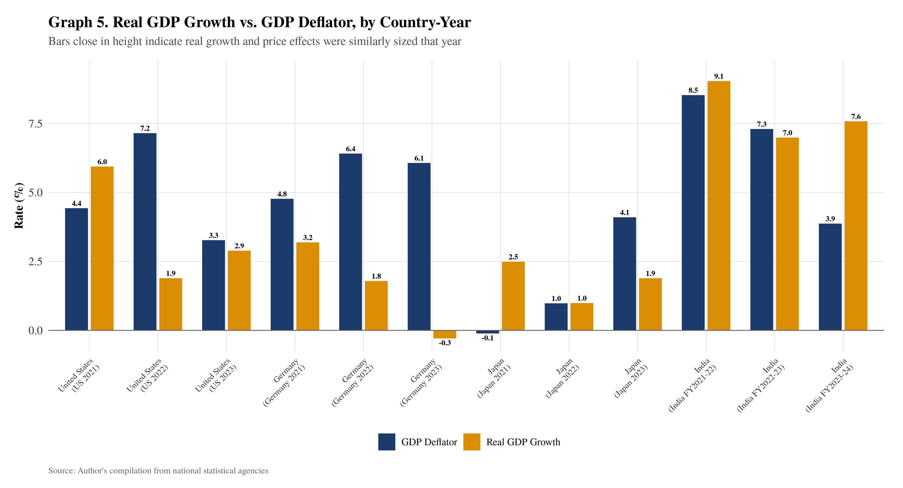
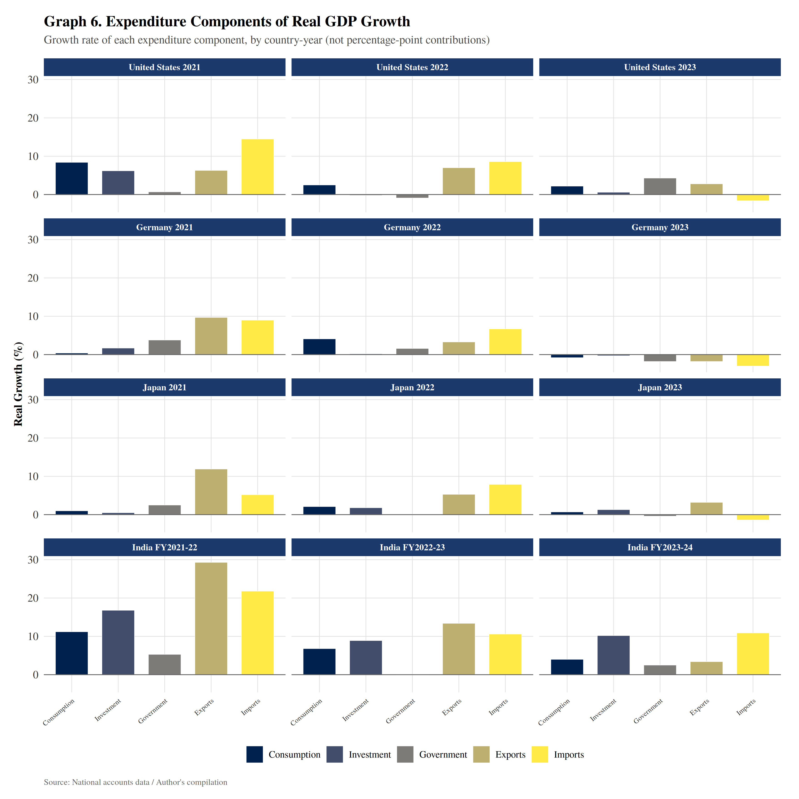
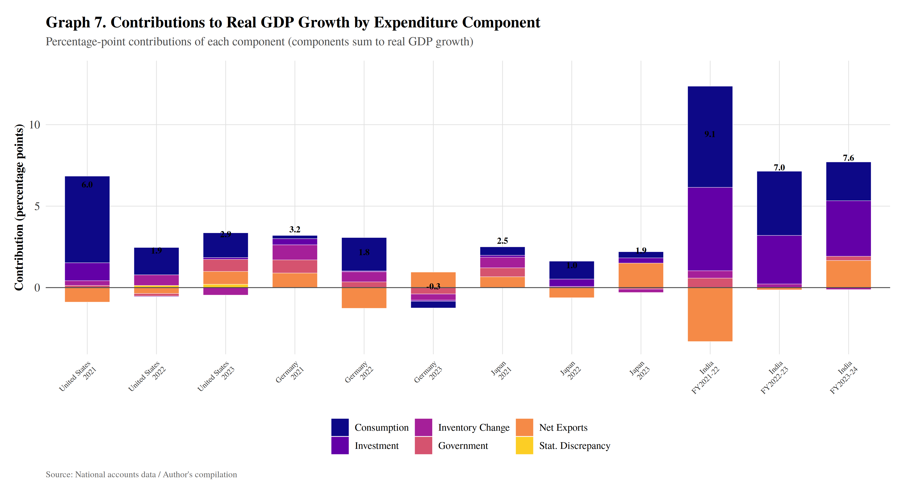
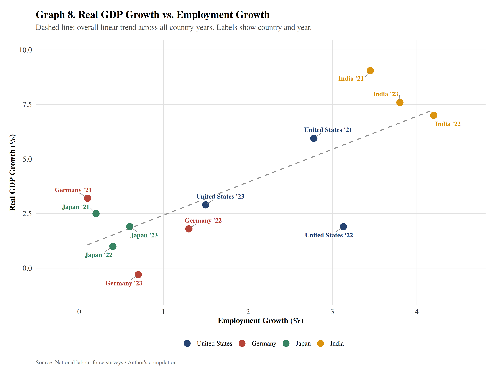
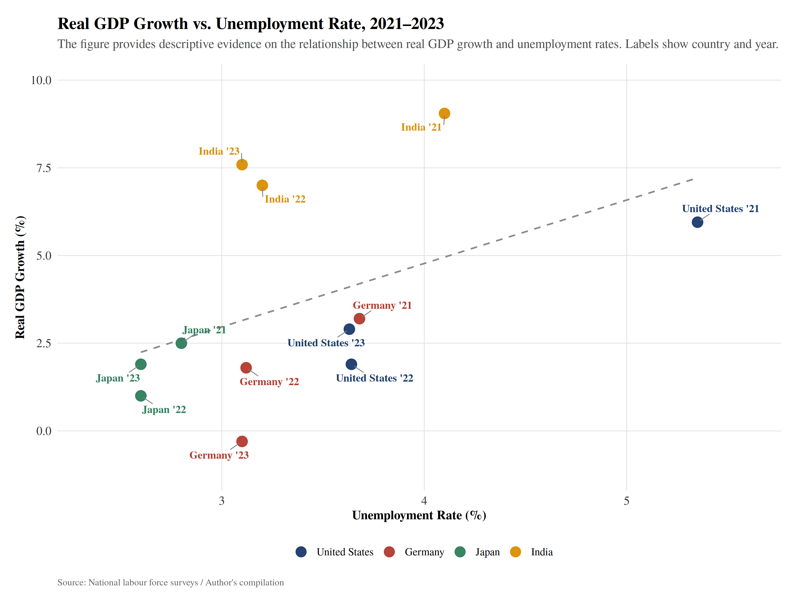
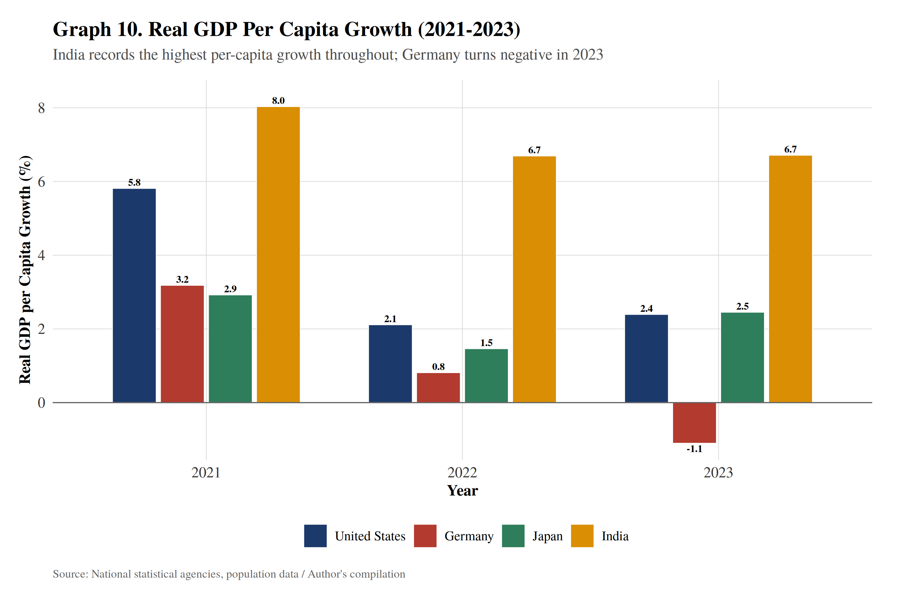

# GDP Analysis (R) — Nominal vs. Real GDP During High-Inflation Periods

**Case study:** *Assessing Whether Post-Pandemic GDP Growth Reflected Real Economic Expansion or Price-Driven Nominal Growth*
**Countries covered:** United States · Germany · Japan · India
**Period:** 2021–2023 (2019 used as pre-pandemic benchmark)

This repository contains all data, R scripts, and output graphs for the Data Collection & Graphs sections of the group case study.

---

## The question

Between 2021 and 2023, GDP rose sharply across major economies — but did that growth reflect genuine expansion in output, or was it substantially inflated by rising prices? This project builds 10 reproducible graphs that decompose nominal GDP growth into its real (volume) and price (inflation) components across four contrasting economies.

---

## About the research

This case study was prepared as **Internal Assessment 2** for **OE Economics (SYBCom)**, under subject teacher **Angela Thomas**.

The report examines the post-pandemic recovery (2021–2023) across the United States, Germany, Japan, and India, comparing nominal and real GDP growth, the GDP deflator, CPI inflation, expenditure components and their contributions to growth, labour-market outcomes (employment and unemployment), and real GDP per capita — to assess whether headline GDP growth in this period represented genuine economic expansion or was substantially a price-driven, nominal effect. The analysis draws on data from national statistical agencies (BEA, BLS, Destatis, Japan's Cabinet Office, MoSPI) and international institutions (IMF, World Bank, OECD), and follows UN System of National Accounts 2008 methodology throughout.

**Group 3 — Research team:**

| Member | Contribution |
|---|---|
| Sharanya & Mahi | Reference article review & post-pandemic inflation analysis |
| Piyush | Nominal vs. real GDP & GDP deflator analysis |
| Gravit | Data collection |
| Chandan | Graphs & data analysis; referencing |
| Pranay & Adwait | Country case studies & policy response; critical evaluation & supporting research |

This repository specifically covers the **data collection and graphs** component of the shared case study.

---

## Graphs

### Graph 1 — Nominal vs. Real GDP Growth


Nominal GDP growth exceeded real GDP growth in almost every country-year, showing that price increases formed a substantial part of headline growth. India's large nominal figures were still backed by strong real growth; Germany's nominal growth masked much weaker real performance.

### Graph 2 — Nominal–Real GDP Growth Gap


Tracks the Nominal − Real gap over time, by country. The US gap peaked in 2022 and narrowed sharply by 2023; Germany's gap stayed persistently wide; India's gap shrank steadily even as its real growth stayed strong.

### Graph 3 — GDP Deflator vs. CPI Inflation


Compares two different price measures per country. CPI (consumer prices) and the GDP deflator (economy-wide prices) don't always move together, since they price different baskets of goods and services.

### Graph 4 — Real GDP Recovery Trajectory (2019 = 100)


Indexes each country's real GDP to its 2019 (pre-pandemic) level. By 2023, India (119.1) and the United States (108.6) had grown well past pre-pandemic output; Japan (101.1) and Germany (100.8) had barely recovered.

### Graph 5 — Real GDP Growth vs. GDP Deflator


Puts the price effect (deflator) and the output effect (real growth) side by side for every country-year. Shows that high price growth can coincide with either strong real growth (India) or real contraction (Germany) — the relationship is descriptive, not causal.

### Graph 6 — Growth of Real GDP Expenditure Components


Breaks real GDP growth down by expenditure component (consumption, investment, government, exports, imports) for each country-year, showing the composition of the recovery.

### Graph 7 — Contributions to Real GDP Growth by Expenditure Component


Shows the percentage-point contribution of each expenditure component to total real GDP growth — the strongest evidence that growth was driven by identifiable real activity (consumption, investment) rather than prices alone.

### Graph 8 — Real GDP Growth vs. Employment Growth


A scatter plot of real GDP growth against employment growth, with a trend line. Most country-years show output and jobs moving together, supporting (though not proving) that growth was broad-based.

### Graph 9 — Real GDP Growth vs. Unemployment Rate


Plots real GDP growth against the unemployment rate. Treated as descriptive rather than a formal test of Okun's Law, since it uses the unemployment level rather than its change.

### Graph 10 — Real GDP Per Capita Growth


Tracks real GDP per capita growth by country and year — important because population growth can mean headline GDP growth overstates how much better off people actually are. India leads throughout; Germany turns negative in 2023.

---

## Folder structure

```
gdp-growth-visualization/
├── data/                              # Source data (CSV), one file per graph/dataset
│   ├── gdp_growth.csv                 # Nominal & real GDP growth (Graphs 1 & 2)
│   ├── deflator_cpi.csv               # GDP deflator vs CPI inflation (Graph 3)
│   ├── real_gdp_index.csv             # Real GDP index, 2019=100 (Graph 4)
│   ├── deflator_vs_realgrowth.csv     # Deflator vs real growth (Graph 5)
│   ├── expenditure_components_growth.csv  # Expenditure component growth rates (Graph 6)
│   ├── contribution_to_growth.csv     # PP contributions to real growth (Graph 7)
│   ├── employment_vs_growth.csv       # Employment vs real growth, scatter (Graph 8)
│   ├── unemployment_vs_growth.csv     # Unemployment vs real growth, scatter (Graph 9)
│   ├── gdp_per_capita_growth.csv      # Real GDP per capita growth (Graph 10)
│   └── cumulative_summary.csv         # 2021-2023 cumulative summary table (reference)
│
├── scripts/
│   ├── 00_theme.R                     # Shared academic ggplot2 theme + color palette + save helper
│   └── 01_generate_graphs.R           # Generates all 10 graphs, saves to output/graphs/
│
├── output/
│   └── graphs/                        # Final graphs (PNG + PDF)
│       ├── graph1_nominal_vs_real_gdp_growth.png / .pdf
│       ├── graph2_nominal_real_gap.png / .pdf
│       ├── graph3_deflator_vs_cpi.png / .pdf
│       ├── graph4_real_gdp_recovery_index.png / .pdf
│       ├── graph5_realgrowth_vs_deflator_scatter.png / .pdf
│       ├── graph6_expenditure_components_growth.png / .pdf
│       ├── graph7_contribution_to_growth_stacked.png / .pdf
│       ├── graph8_realgrowth_vs_employment_scatter.png / .pdf
│       ├── graph9_realgrowth_vs_unemployment_scatter.png / .pdf
│       └── graph10_real_gdp_per_capita_growth.png / .pdf
│
├── run_all.R                          # One-command entry point (installs packages if missing, then runs everything)
└── README.md                          # This file
```

## How to run

1. Open R / RStudio with this repository's root folder as your working directory.
2. Run:
   ```r
   source("run_all.R")
   ```
   or from a terminal:
   ```bash
   Rscript run_all.R
   ```
3. All 10 graphs are (re)generated in `output/graphs/` as both `.png` (300+ dpi, for
   Word/PowerPoint/Google Docs) and `.pdf` (vector, for LaTeX or print-quality inclusion).

## Packages used

`ggplot2`, `dplyr`, `tidyr`, `readr`, `scales`, `forcats`, `ggrepel`, `viridis`
— all CRAN packages, auto-installed by `run_all.R` if missing.

## Design notes

- **Theme:** `theme_academic()` in `scripts/00_theme.R` — serif (Times-like) font,
  minimal gridlines, bold titles, italic-grey subtitles, and a source caption on
  every plot, styled to fit a formal case-study report.
- **Color palette:** a fixed, colorblind-safe country palette (navy = US, brick red =
  Germany, forest green = Japan, amber = India) used consistently across every graph
  so a reader can identify a country at a glance without re-reading the legend.
- **Every graph cites its data source** in a caption — carry these captions/notes
  over into your report's figure captions for the Bibliography & Data Referencing
  criterion.

## Data sources

Bureau of Economic Analysis (BEA) · Bureau of Labor Statistics (BLS) · Statistisches Bundesamt (Destatis) · Cabinet Office, Government of Japan · Statistics Bureau of Japan · Ministry of Statistics and Programme Implementation (MoSPI), India · IMF · World Bank · OECD · UN System of National Accounts 2008 (methodology for all formulas).

## Editing / extending

- To swap in a different country or updated figures, edit the relevant CSV in `data/`
  — no code changes needed, the scripts read directly from these files.
- To restyle all graphs at once (e.g. change the font or palette), edit `scripts/00_theme.R`
  only; every graph inherits from `theme_academic()` and `country_colors`.
